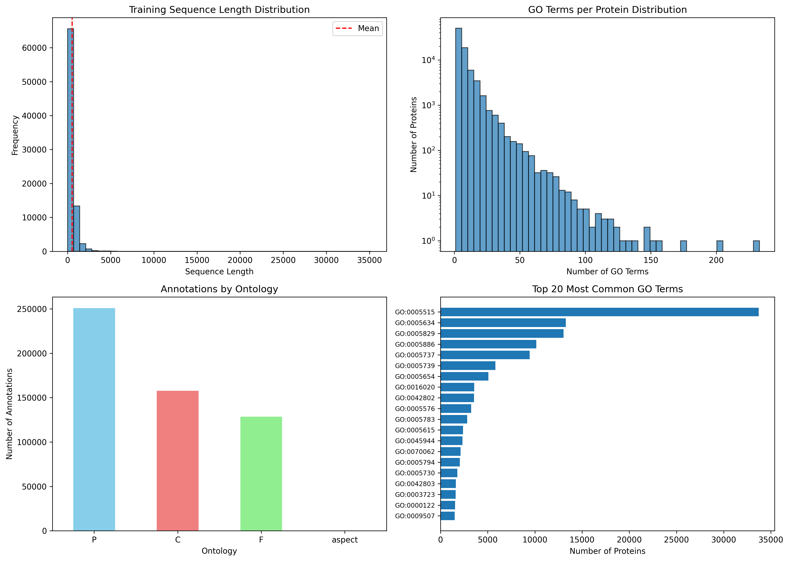

# CAFA-6 Protein Function Prediction

Predict Gene Ontology (GO) functional annotations for proteins directly from their
amino-acid sequences. This is a hierarchical, multi-label classification problem
taken from the [CAFA-6 Kaggle competition](https://www.kaggle.com/competitions/cafa-6-protein-function-prediction)
(CAFA = Critical Assessment of Function Annotation).

**Author:** Nishan Khareln

> **Status note (please read).** Stages 1–3 (dataset exploration, a GO ontology
> parser with ancestor propagation, and prepared label matrices) are implemented
> with artifacts committed here. Stages 4–5 (ESM-2 embeddings, three per-ontology
> models, and a Streamlit prediction app) were also built and run — see the
> [Demo](#demo) screenshots — but their code, trained weights, and embeddings are
> **not included in this repository snapshot**. Dataset and parser numbers below
> are measured; the model's headline result is the author-reported Kaggle
> leaderboard F-max (≈0.25, see [Results](#results)). See [Current status](#current-status).

---

## Problem

Every protein performs one or more biological roles, described in a standardized
vocabulary called the **Gene Ontology (GO)**. Determining a protein's function
experimentally is slow and expensive, while sequencing is fast and cheap, so most
known protein sequences are functionally uncharacterized. The goal here is to
**predict GO terms for a protein from its amino-acid sequence alone**.

- **Input:** an amino-acid sequence (e.g. `MRWQEMGYIFYPRKLR...`), one per protein.
- **Output:** a set of GO terms, each with a confidence score in `[0, 1]`.

GO is split into three independent sub-ontologies, predicted separately:

| Code | Sub-ontology | Question it answers | Example terms |
|------|--------------|---------------------|---------------|
| MFO (F) | Molecular Function | What does the protein *do* at the molecular level? | "kinase activity", "DNA binding" |
| BPO (P) | Biological Process | Which processes does it *participate in*? | "cell division", "immune response" |
| CCO (C) | Cellular Component | *Where* in the cell is it located? | "nucleus", "membrane" |

---

## Why this is non-trivial

- **Large, sparse label space.** The full ontology has **40,122 GO terms**
  (10,131 MFO / 25,950 BPO / 4,041 CCO). The training annotations alone span
  **26,126 distinct terms**. Most proteins carry only a handful of labels, so the
  protein × term label matrix is extremely sparse.
- **Multi-label, not single-label.** A protein can have many functions at once.
  In this dataset proteins carry between **1 and 233 annotations** (mean ≈ 6.5).
- **Hierarchical labels.** GO terms form a directed acyclic graph. If a specific
  term is true, *all of its ancestor terms are also true*. Predictions must
  respect this structure to be biologically valid. Concretely, the parser in this
  repo expands a 2-term annotation into **260 terms** after ancestor propagation.
- **Severe class imbalance.** A few generic terms dominate (e.g. `GO:0005515`,
  "protein binding", appears on 33,713 proteins) while most terms are rare.

---

## Dataset

Files live under `data/` (and the original competition copies under `Train/`,
`Test/`). All figures below are measured from the data in this repository.

| Property | Value |
|----------|-------|
| Training proteins (`train_sequences.fasta`) | 82,404 |
| Test proteins (`testsuperset.fasta`) | 224,309 |
| Total training annotations (`train_terms.tsv`) | 537,028 |
| Distinct GO terms in training annotations | 26,126 |
| GO terms in the ontology graph (`go-basic.obo`) | 40,122 |
| Training sequence length (min / mean / max) | 3 / ~526 / 35,213 |
| Annotations per protein (min / mean / max) | 1 / 6.5 / 233 |

Annotation breakdown by sub-ontology (from `train_terms.tsv`):

| Sub-ontology | Annotations | Distinct terms |
|--------------|-------------|----------------|
| Biological Process (P) | 250,805 | 16,858 |
| Cellular Component (C) | 157,770 | 2,651 |
| Molecular Function (F) | 128,452 | 6,616 |

Sequences are stored in **FASTA** format (a `>` header line followed by the
single-letter amino-acid sequence). The ontology graph is the standard GO
**OBO** file. `data/IA.tsv` holds the per-term Information Accretion weights used
by the CAFA F-max metric.



---

## Approach

The pipeline has five stages. Stages 1–3 are implemented with artifacts committed
here. Stages 4–5 were built and run — a working Streamlit app produced live
predictions (see [Demo](#demo)) — but their code, trained weights, and embeddings
are not committed in this snapshot. See [Current status](#current-status).

1. **Data exploration** (`exploration.ipynb`) — load sequences and annotations,
   measure length/label distributions, confirm the multi-label and imbalance
   characteristics, and save summary plots (`cafa6_data_exploration.png`).

2. **GO ontology parsing + propagation** (`build_go_parser.py` → `go_parser.pkl`)
   — parse `go-basic.obo` into a graph, then for every term resolve its full set
   of ancestors. Training labels are propagated *up* the hierarchy so a specific
   annotation also implies all of its parents. This keeps both the training
   labels and the final predictions hierarchically consistent.

3. **Label preparation** (`processed_data/`) — for each sub-ontology, select the
   most frequent terms and build a binary protein × term matrix
   (`1` = protein has that function). Verified shapes:
   - `train_labels_MFO.npy` — (82,404 × 500), `int8`
   - `train_labels_BPO.npy` — (82,404 × 800), `int8`
   - `train_labels_CCO.npy` — (82,404 × 400), `int8`
   - `train_protein_ids.pkl` — ordered list of the 82,404 protein IDs
   - `selected_terms.pkl` — `{selected_terms, term_to_idx, idx_to_term}` per ontology

4. **Feature extraction with ESM-2** *(built; code/weights not committed — see [Demo](#demo))* — encode
   each sequence with the pretrained protein language model
   `facebook/esm2_t33_650M_UR50D` into a fixed 1,280-dimensional embedding,
   giving the downstream model evolutionary/structural context learned from
   hundreds of millions of sequences.

5. **Per-ontology models + hierarchy-aware prediction** *(built; code/weights not
   committed — see [Demo](#demo))* — train one multi-label classifier per sub-ontology on the
   embeddings, then enforce GO consistency at inference (a child term's
   confidence is propagated to its ancestors) before writing the CAFA submission
   file (`EntryID \t term \t confidence`).

---

## Current status

| Stage | Component | State | Evidence in repo |
|-------|-----------|-------|------------------|
| 1 | Data exploration | **Done** | `exploration.ipynb`, `cafa6_data_exploration.png` |
| 2 | GO parser + ancestor propagation | **Done** | `go_parser.pkl`, `build_go_parser.py` |
| 3 | Label-matrix preparation | **Done** | `processed_data/*.npy`, `*.pkl` |
| 4 | ESM-2 embedding extraction | **Built, not committed** | used by the app (see Demo); embeddings absent here |
| 5 | Model training (3 per-ontology models) | **Built, not committed** | predictions shown in Demo; weights absent here |
| 5 | Streamlit prediction app | **Built, not committed** | screenshots in Demo; `app.py` absent here |
| — | Kaggle leaderboard F-max | **≈0.25 (author-reported)** | overall score; confirm exact value on Kaggle — see Results |

---

## Demo

A Streamlit web app loads the three trained per-ontology models and predicts GO
terms for a pasted amino-acid sequence. The app code, trained weights, and
embeddings are **not committed to this repository** — the screenshots below are
from a local run (2025-12-28) and stand as evidence the end-to-end system worked.


*A 30-residue input: the app reports sequence properties and runs all three
ontology models. Here no term passed the 50% display threshold.*


*Per-term confidences from the Cellular Component model (e.g. "extracellular
space", GO:0005615, 48.8%). These are confidences for a single input, not a
held-out accuracy score.*

---

## Results

This project was submitted to the [CAFA-6 Kaggle competition](https://www.kaggle.com/competitions/cafa-6-protein-function-prediction),
which scores predictions with **F-max**: for each sub-ontology, sweep the
confidence threshold from 0 to 1 in 0.01 steps, compute the Information-Accretion
weighted F1 at each, take the maximum, then average across the three. The
leaderboard reports a single combined F-max.

**Overall Kaggle leaderboard F-max ≈ 0.25** — reported by the author; confirm the
exact public/private value on the competition's *My Submissions* page. This is
around the sequence-similarity (BLAST) baseline level: a modest but honest result
for an ESM-2-embedding + MLP approach, with clear room to improve (see
[Limitations and next steps](#limitations-and-next-steps)).

| Sub-ontology | Validation F-max | Test (CAFA) F-max |
|--------------|------------------|-------------------|
| MFO | not computed | not broken out |
| BPO | not computed | not broken out |
| CCO | not computed | not broken out |
| **Overall** | not computed | **≈ 0.25** (Kaggle leaderboard) |

> The leaderboard returns one combined score, so the per-sub-ontology *test*
> numbers are not broken out here. A per-ontology **Validation F-max** can be
> computed locally from a held-out split once the trained model is available —
> replace "not computed" with the measured values then. The app's per-term
> confidences (e.g. 48.8%) are *not* an accuracy score.

---

## Project structure

```
CAFA-6-Protein-Function-Prediction-Model-System/
├── data/                         # Raw CAFA-6 dataset
│   ├── train_sequences.fasta     # 82,404 training sequences
│   ├── testsuperset.fasta        # 224,309 test sequences
│   ├── train_terms.tsv           # 537,028 protein→GO annotations
│   ├── go-basic.obo              # GO graph (40,122 terms)
│   ├── IA.tsv                    # Information Accretion weights
│   └── sample_submission.tsv     # Submission format example
├── Train/  Test/                 # Original competition copies of the above
├── processed_data/               # Output of the label-prep stage
│   ├── train_labels_MFO.npy      # (82,404 × 500) int8
│   ├── train_labels_BPO.npy      # (82,404 × 800) int8
│   ├── train_labels_CCO.npy      # (82,404 × 400) int8
│   ├── train_protein_ids.pkl     # ordered list of 82,404 IDs
│   └── selected_terms.pkl        # term <-> index maps per ontology
├── exploration.ipynb             # Stage 1: dataset exploration + plots
├── build_go_parser.py            # Stage 2: build + pickle the GO parser
├── go_parser.pkl                 # Serialized GO parser (ancestors, propagation)
├── cafa6_data_exploration.png    # Saved EDA figure
├── Screenshot 2025-12-28 120504.png   # Demo screenshot: app overview
├── Screenshot 2025-12-28 120524.png   # Demo screenshot: CCO predictions
├── test.py                       # GPU / CUDA availability check
├── requirements.txt
├── Dockerfile                    # Streamlit app container (expects app.py, not committed here)
├── docker-compose.yaml
├── service.yaml                  # Kubernetes Service (LoadBalancer, port 8501)
└── README.md                     # This file
```

---

## Running it

### 1. Environment

```bash
python -m venv venv
# Windows: venv\Scripts\activate   |   macOS/Linux: source venv/bin/activate
pip install -r requirements.txt
```

Check GPU availability (optional, used by the ESM-2 embedding stage):

```bash
python test.py
```

### 2. Explore the data

Open `exploration.ipynb` in Jupyter and run all cells. It reads the FASTA and
TSV files and regenerates `cafa6_data_exploration.png`. Update the file paths in
the first cells to point at your local `data/` directory.

### 3. Build the GO parser

```bash
python build_go_parser.py
```

> **Note:** `build_go_parser.py` currently imports `scripts.ontologyparser`
> (the `GOGraphParser` class) and uses absolute paths (`D:\CAFA project\...`).
> The `scripts/ontologyparser.py` module and that path are **not included** in
> this snapshot — point the script at `data/go-basic.obo` and add the parser
> module before running, or load the prebuilt `go_parser.pkl` directly.

### 4–5. Embeddings, training, prediction app

Built and run previously (see [Demo](#demo)) but not committed to this repo. See
[Limitations and next steps](#limitations-and-next-steps) for what to add back.

### Docker

The `Dockerfile`, `docker-compose.yaml`, and `service.yaml` describe the
Streamlit web app on port `8501`:

```bash
docker compose up --build       # serves on http://localhost:8501
```

> **Note:** the image build expects `app.py`, `models/`, and `embeddings/`. The
> app was built and run locally (see [Demo](#demo)), but these files are not
> committed here, so the container will not build until they are added.

---

## Limitations and next steps

- **Training/inference code and the app are not committed.** They were built and
  run (see [Demo](#demo)) but are absent from this snapshot. Commit the ESM-2
  embedding extraction, per-ontology training, prediction, and `app.py`, then
  record a real held-out F-max score in the [Results](#results) table.
- **Restore the parser module.** Add `scripts/ontologyparser.py` (`GOGraphParser`)
  and replace the hard-coded absolute paths in `build_go_parser.py` with relative
  paths so the parser rebuilds cleanly.
- **Sequence length handling.** Sequences range up to ~35,000 residues; the
  embedding stage needs truncation or chunking.
- **Class imbalance.** Rare terms are hard to learn; consider per-term weighting,
  threshold tuning per ontology, or focal loss.
- **Deployment.** Add the `app.py` the Docker/Kubernetes configs expect, or update
  those configs to match what the project actually serves.
- **Possible improvements.** Fine-tuning ESM-2 end-to-end, a graph neural network
  over the GO hierarchy, and model ensembling.

---

## Tech stack

- **Language:** Python 3.10+
- **Data / numerics:** NumPy, pandas
- **Bioinformatics:** Biopython (FASTA parsing), obonet + NetworkX (GO graph)
- **Deep learning:** PyTorch, Hugging Face Transformers (ESM-2)
- **Visualization:** Matplotlib, seaborn
- **App / deployment:** Streamlit, Docker, Kubernetes

---

## References

1. [CAFA-6 Protein Function Prediction](https://www.kaggle.com/competitions/cafa-6-protein-function-prediction)
   — Kaggle competition (problem statement, data, and the official F-max leaderboard).
2. Lin et al. (2023). *Evolutionary-scale prediction of atomic-level protein
   structure with a language model* (ESM-2).
3. The CAFA challenge reports (2011–present).
4. Ashburner et al. (2000). *Gene Ontology: tool for the unification of biology.*
